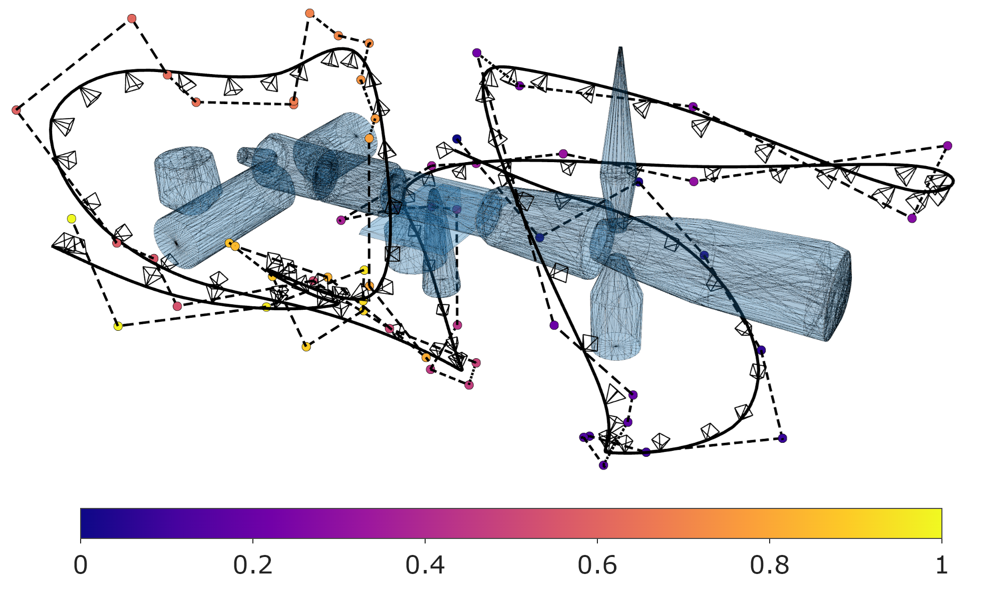
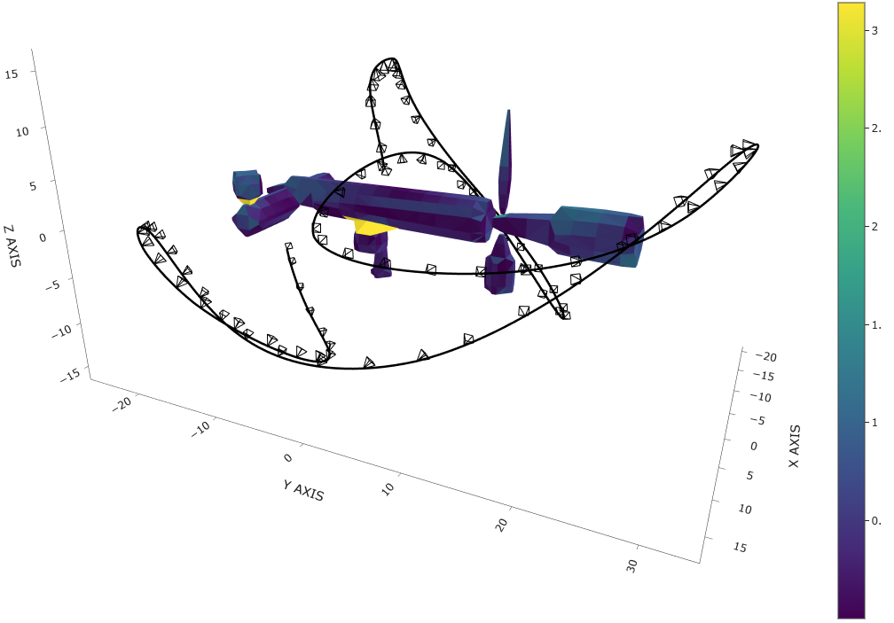
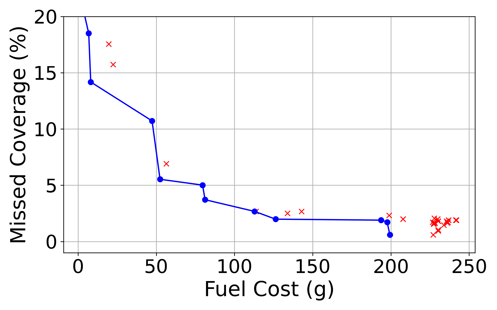

# Semi-Autonomous Visual Inspection Trajectory Planning for the ISS

This repository contains the code and simulation assets for the paper:

**"Semi-Autonomous In-Orbit Inspection of Complex Space Structures via Coverage-Aware Trajectory Optimization"**

## 📄 Summary

Extravehicular activity (EVA) for ISS visual inspection poses safety risks to astronauts. This project presents a trajectory generation pipeline for space robots that enables safe, semi-autonomous inspection of complex space structures. Our method integrates:

- **Orbital dynamics modeling**
- **Coverage path planning**
- **Energy and thrust constraints**
- **Pareto front analysis** for balancing fuel and inspection coverage
- **Human supervisor situation awareness** modeling

The resulting trajectories achieve **98% coverage** using just **17 grams of fuel** on an ISS-scale model, demonstrating effective and efficient planning for in-orbit visual inspection.

## 🛰️ Features

- Collision-aware trajectory generation
- Optimization of coverage vs. fuel usage
- Orbital mechanics constraints (Clohessy-Wiltshire dynamics)
- Visualization of trajectories and coverage
- Simulation of free-flyer robot behavior

## 🛠️ Installation

Clone the repository:

```bash
git clone https://github.com/bapodacaumich/ccpp_public.git
cd ccpp_public
```

# C++ file creation

create a build folder and use cmake to create executables for ordered coverage viewpoint optimization

```bash
mkdir build
cd build
cmake ..
make
```

# Python Packages

Requirements: python==3.10.9

Python packages: requirements.txt

## 🚀 Usage

Generate ordered viewpoints, then generate an optimized trajectory guided by the ordered viewpoints. Finally, visualize solutions.

# Ordered Viewpoint Generation

Run the main script to generate ordered viewpoint solutions for a specified VGD and locality constraint.

```bash
./run_ccpp [vgd] [-l]
```

ordered viewpoint solutions are stored in /data/ordered_viewpoints/ as [vgd]m_[local OR global].csv files 
- 'global' indicates no local condition was applied
- the resulting file is a list of ordered viewpoints and poses for obstacle avoidance that correspond to ${\hat{q}_i}$ in the paper.

# Trajectory Optimization and Pareto Front Tuning

The '/knot_ocp/' folder contains python code for trajectory optimization and pareto front selection.

1. pareto_grid.py: contains functions that can be used to create solutions with a prespecified range of weights. Each solution is a set of ordered states including position, velocity, control actuation, and timestep information. Each solution is saved in three files:
- *_X.csv: position and velocity of optimized trajectory at each discretized state
- *_U.csv: control actuation for each timestep
- *_t.csv: timestamps of each discretized state

2. package_path.py: processes solutions outputs from the optimal control formulation. Here you may specify orientation assignment methods. We used Knot Oriented (SLERP) and Face Oriented (SLERP) methods.

3. /build/get_coverage/: evaluates the coverage of each processed solution for Pareto tuning

4. pareto_front.py: contains functions that can be used to evaluate the pareto front solutions within a set of a solutions. You must pick a solution(s) from the pareto front that optimizes coverage and fuel consumption to your liking.

# Trajectory Visualization

The '/visualization_python/' folder contains python code for solution visualization.

First, move final 'packaged' paths to the '/visualization_python/final_paths/' folder.

Then, Inspection quality evaluation can be performed by first evaluating a finely discretized trajectory using the get_coverage, cw_coverage, and saturation scripts in the /build/ folder.

Finally, the python scripts in '/visualization_python/' use Plotly to generate 3d plots in a web-browser (using OpenGL).

Examples of visualized solutions exist in the '/visualization_python/figures/' folder.

## 📊 Results

Example outputs:

1. Trajectory, ordered viewpoints, and convex station keepout region.
<p align="left">
  
</p>

2. Trajectory Minimum Angle of incidence per face (0 to pi radians).
<p align="left">
  
</p>

3. Pareto fronts of two metrics (of three total) plotted against eachother. We use Missed Coverage and Fuel Cost in our paper.
<p align="left">
    
</p>

## Algorithm Pseudocode

# Viewpoint Planning

**Viewpoint Generation**:

> $\{VP_{all}\} \leftarrow \emptyset$
>
> for $face$ in $M$:
>
> $\quad q \leftarrow$ extend viewpoint from $face$ centroid by $VGD$
>
> $\quad \{VP_{all}\} \leftarrow \{VP_{all}\} \cup q$

**Viewpoint Filtering:**

> $VP \leftarrow \emptyset$
> 
> $iteration \leftarrow 0$
> 
> while $\exists a \in M \; s.t. \; \forall q \in \{VP\} \; cvg(q,a) = 0$:
> 
> $\quad VP \leftarrow VP \cup \max( \; IG(q,VP) \; : q \in \{VP_{all} \setminus VP \})$
> 
> $\quad$ if $iteration$ == $0$:
> 
> $\qquad$ for $q$ in $VP$:
> 
> $\qquad \quad$ if $IG(q, \{VP \setminus q \}) == 0$ then $VP \leftarrow \{ VP \setminus q\}$

**Cost Matrix Construction:**

First find all collision free paths:

> $VP \leftarrow VP \cup q_s$
>
> for $i$ in $|VP|$
> 
> $\quad$ for $j$ in $|VP|$
>
> $\qquad$ if $j \geq i$:
>
> $\qquad \quad x_{ij}, c_{ij} \leftarrow RRTZ(q_i, q_j)$ 
>
> $\qquad \quad x_{ji}, c_{ji} \leftarrow reverse(x_{ij})$

Compute prior node dependent costs:

> $C \leftarrow \emptyset$
>
> for $i$ in $|VP|$
>
> $\quad$ for $j$ in $|VP|$
>
> $\qquad$ for $k$ in $|VP|$
>
> $\qquad \quad C_{ijk} \leftarrow c_{jk} + c_{ijk}$

Order the viewpoints (global)

> Greedily generate initial order $(VP)$
>
> $old \textunderscore cost \leftarrow \infty$ 
>
> while $cost( (VP) ) < old \textunderscore cost$:
>
> $\quad$ repeat for every 2-opt step:
>
> $\qquad (VP)' \leftarrow 2-opt( (VP) )$
>
> $\qquad$ if $cost( (VP)' ) > cost( (VP) ): continue
>
> $\qquad$ else: $(VP) \leftarrow (VP)'$
>
> $\quad old \textunderscore cost \leftarrow cost( (VP) )$

Order the viewpoints (local)

> Greedily generate initial order $(VP)$
>
> $old \textunderscore cost \leftarrow \infty$ 
>
> while $cost( (VP) ) < old \textunderscore cost$:
>
> $\quad$ repeat for every 2-opt step:
>
> $\qquad (VP)' \leftarrow 2-opt( (VP) )$
>
> $\qquad$ if $cost( (VP)' ) > cost( (VP) )$ or $local$ constraint doesn't hold: continue
>
> $\qquad$ else: $(VP) \leftarrow (VP)'$
>
> $\quad old \textunderscore cost \leftarrow cost( (VP) )$

## 🧠 Citation

If you use this code or build upon this work, please cite: (WIP)

```
@inproceedings{yourCitation2025,
  title={In-Orbit Space Structure Inspection Trajectory Generation},
  author={Brandon Apodaca, Thor Helgeson, Ella Atkins, Leia Stirling},
  year={2025},
  booktitle={...}
}
```

<!-- ## 📄 License

This project is licensed under the GPL License. See `LICENSE` for details. -->